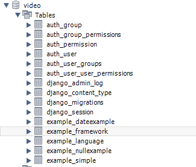
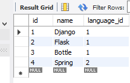
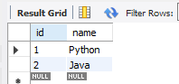
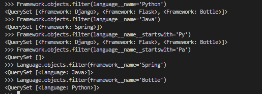
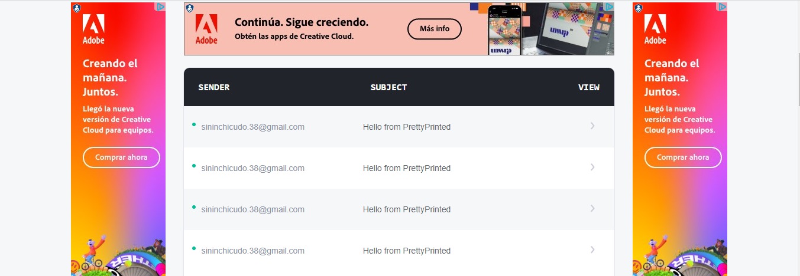
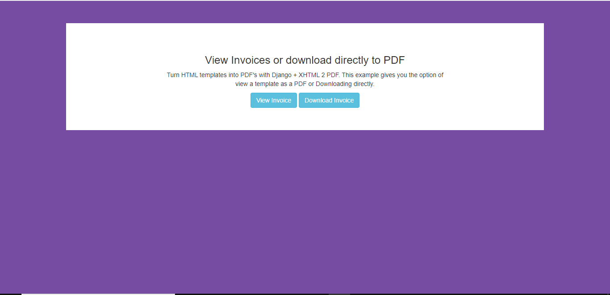
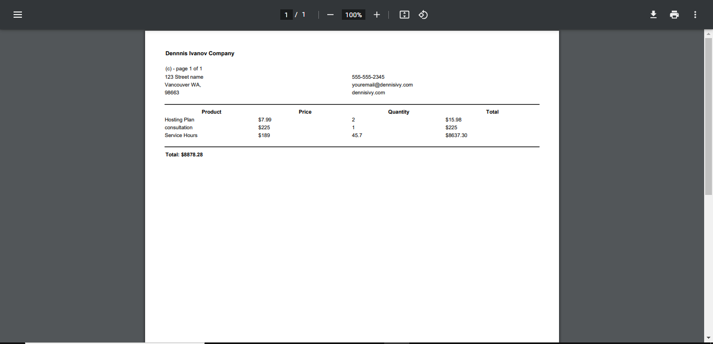
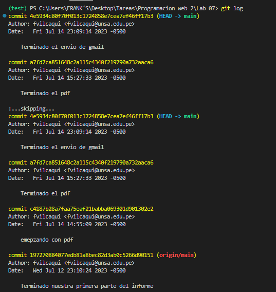
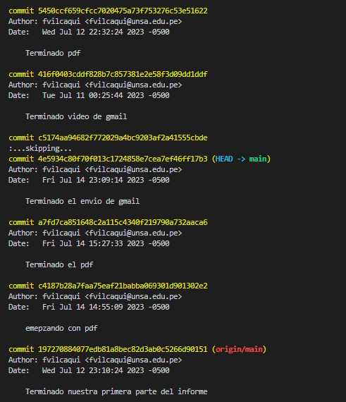
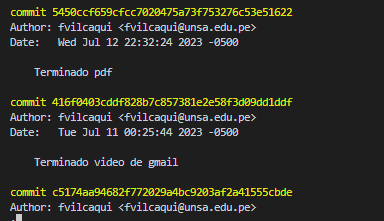

<table width="1000px">
    <theader>
        <tr>
            <td></td>
            <th>
                UNIVERSIDAD NACIONAL DE SAN AGUSTIN 
                FACULTAD DE INGENIERÍA DE PRODUCCIÓN Y SERVICIOS 
                DEPARTAMENTO ACADÉMICO DE INGENIERÍA DE SISTEMAS E INFORMÁTICA 
                ESCUELA PROFESIONAL DE INGENIERÍA DE SISTEMAS
            </th>
            <td></td>
        </tr>
    </theader>
    <tbody>
        <tr><td colspan="3">Formato: Guía de Práctica de Laboratorio</td></tr>
        <tr><td>Aprobación:  2022/03/01</td><td>Código: GUIA-PRLD-001</td><td>Página: 1</td></tr>
    </tbody>
</table>

    INFORME DE LABORATORIO 

    <table width="1000px">
        <theader>
            <tr><th colspan="6">INFORMACIÓN BÁSICA</th></tr>
        </theader>
        <tbody>
            <tr><td>ASIGNATURA:</td><td colspan="5">Programación Web 02</td></tr>
            <tr><td>TÍTULO DE LA PRÁCTICA:</td><td colspan="5">Relaciones, Impresiones y Envios de Gmail en Django</td></tr>
            <tr><td>NÚMERO DE PRÁCTICA:</td><td>07</td><td>AÑO LECTIVO:</td><td>2023 A</td><td>NRO. SEMESTRE:</td><td width="60px">  III  </td></tr>
            <tr><td>FECHA DE PRESENTACIÓN:</td><td>14-06-2023</td><td>HORA DE PRESENTACIÓN:</td><td colspan="3">11:00</td></tr>
            <tr>
              <td colspan="4">NOMBRE:
                <ul>
            	    <li>Vilca Quispe, Frank's Javier</li>
                </ul>
              </td>
              <td>NOTA:</td><td></td>
            </tr>
            <tr>
              <td colspan="6" width="1000px">DOCENTES:
                <ul>
        	        <li>Anibal Sardon Paniagua</li>
                </ul>
              </td>
            </tr>
        </tbody>
    </table>

# Django

[![License][license]][license-file]
[![Downloads][downloads]][releases]
[![Last Commit][last-commit]][releases]

[![Debian][Debian]][debian-site]
[![Git][Git]][git-site]
[![GitHub][GitHub]][github-site]
[![Vim][Vim]][vim-site]
[![Java][Java]][java-site]

## OBJETIVOS TEMAS Y COMPETENCIAS

### OBJETIVOS

- **Implementar** clases para poder mejorar
el uso de Django y facilitar su uso cotidiano
### TEMAS

- Proyectos de Django
- Aplicaciones en Django
- Base de datos con Django
- Opciones interactivas con DJango

COMPETENCIAS

- C.c Diseña responsablemente sistemas, componentes o procesos para satisfacer necesidades dentro de restricciones realistas: económicas, medio
  ambientales, sociales, políticas, éticas, de salud, de seguridad, manufacturación y sostenibilidad.
- C.m Construye responsablemente soluciones siguiendo un proceso adecuado llevando a cabo las pruebas ajustada a los recursos disponibles del cliente.
- C.p Aplica de forma flexible técnicas, métodos, principios, normas, estándares y herramientas de ingeniería necesarias para la construcción 
  de software e implementación de sistemas de información.

#

## Ejercicios Propuestos

## VIDEO 1
- En el video 1 no pide que creemos nuestra base de datos, en este caso lo crearemos con mysql para poder manejarlo de una manera mas sensilla.
- En esta ocasion crearemos 5 tablas con las cuales trabajaremos
 
 
<td></td> 
- En esta imagen se puede observar las tablas creadas en Mysql.  
 
<td></td> 
- En esta imagen se observa los franework creados en nuestra base de datos, los cuales tendran una llave fk y un codigo que indica a que lenguaje corresponde.
 
 
<td></td> 
- En esta imagen se observa la tabla de los lenguage id previamente creados.

#

## VIDEO 2
- En el video 2 utilizamos el comando "python.manage shell", el cual nos envia a un modo consola.
- En este video nos muestra una manera sencilla de como se utiliza para luego poder hacer trabajos mas complejos.
 
 
<td></td> 
- En esta imagen se observa un ejemplo de como se ha ido utilizando.

#

## VIDEO 3
- En este video crearemos tablas utilizando este modo de comandos y tambien crearemos entidades de relacion.
- En este caso trabajaremos con las tablas movie y character.
 
 
<td></td> 
- En esta imagen se puede observar como se utiliza los codigos para crear las tablas.
 
 
<td></td> 
- Aqui podemos observar como creamos los elementos de nuestras tablas.
 
 
<td></td> 
- Aqui podemos observar la tabla de las peliculas con sus respectivas fk.
 
 
<td></td> 
- Aqui podemos observar la tabla de los character o personajes con sus respectivas fk.
 
 
<td></td> 
- Aqui se observa la relacion entre las dos tablas anteriores en una sola.
- Esta relacion se llama uno a muchos

#

## VIDEO 4
- Este video mas te habla sobre hacer llamados desde el centro de comandos, crear objetos y cambiar los valores.
 
 
<td></td> 
- Ejemplo de su ejecucion

#

## VIDEO 5
- En este video te habla sobre la conexion de DJango con nuestra
base de datos en este caso Mysql
<td></td> 
-Se observa que el nombre de nuestra tabla es video, nuestro usuario tiene el nombre de root, el password es 1234, nuestro host es local osea nuestro propio dispositivo y el puerto 3306.

#

## VIDEO GMAIL
- En este video se observo que se puede enviar mensajes GMAIL mediante el framework de DJango.
 
 
<td></td> 
- En esta imagen se puede observar que nuestros index.html nos confirma que se envio el mensaje al correo correspondiente
 
 
<td></td> 
- En esta imagen estamos observando que llego el mensaje anteriormente enviado.

#

## VIDEO PDF
- En este video lo que se observo esque se puede crear un archivo pdf directamente con el framework de DJango.
 
 
<td></td> 
- En esta imagen se puede observar la primera ventana al ingresar a nuestro servidor nos dira si deseamos 
  descargarla o solamente observarla.
 
 
<td></td> 
- En esta imagen estamos observando el PDF creado antes con html.

#

## Commits
- Estos son los commits realizados mediante se realizaba el proyecto.
<td></td> 
<td></td> 
<td></td> 

#

## link del video: 

- 

#

## link del Repositorio: 

- https://github.com/fvilcaqui/lab07pweb2

#

#

## REFERENCIAS

- https://www.w3schools.com/python/python_reference.asp
- https://docs.python.org/3/tutorial/

#

[license]: https://img.shields.io/github/license/rescobedoq/pw2?label=rescobedoq
[license-file]: https://github.com/rescobedoq/pw2/blob/main/LICENSE
[downloads]: https://img.shields.io/github/downloads/rescobedoq/pw2/total?label=Downloads
[releases]: https://github.com/rescobedoq/pw2/releases/
[last-commit]: https://img.shields.io/github/last-commit/rescobedoq/pw2?label=Last%20Commit
[Debian]: https://img.shields.io/badge/Debian-D70A53?style=for-the-badge&logo=debian&logoColor=white
[debian-site]: https://www.debian.org/index.es.html
[Git]: https://img.shields.io/badge/git-%23F05033.svg?style=for-the-badge&logo=git&logoColor=white
[git-site]: https://git-scm.com/
[GitHub]: https://img.shields.io/badge/github-%23121011.svg?style=for-the-badge&logo=github&logoColor=white
[github-site]: https://github.com/
[Vim]: https://img.shields.io/badge/VIM-%2311AB00.svg?style=for-the-badge&logo=vim&logoColor=white
[vim-site]: https://www.vim.org/
[Java]: https://img.shields.io/badge/java-%23ED8B00.svg?style=for-the-badge&logo=java&logoColor=white
[java-site]: https://docs.oracle.com/javase/tutorial/

[![Debian][Debian]][debian-site]
[![Git][Git]][git-site]
[![GitHub][GitHub]][github-site]
[![Vim][Vim]][vim-site]
[![Java][Java]][java-site]

[![License][license]][license-file]
[![Downloads][downloads]][releases]
[![Last Commit][last-commit]][releases]